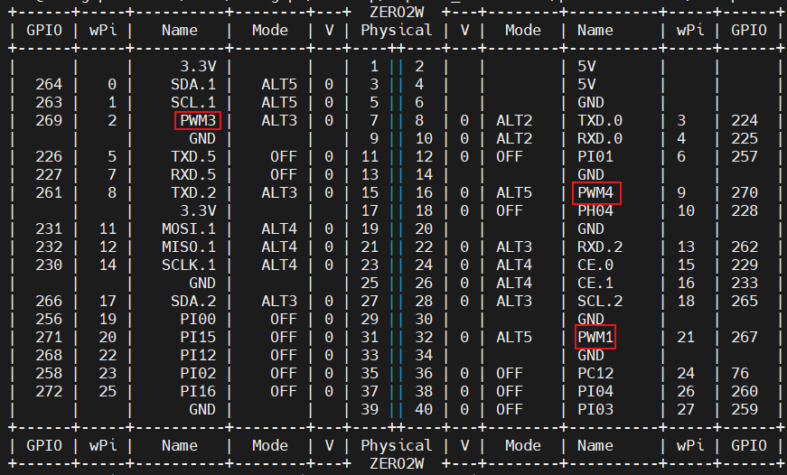

#### I2C


#### PWM



```bash
cd /sys/class/pwm/pwmchip0

echo 1 > ./export
echo 2 > ./export
echo 3 > ./export
echo 4 > ./export

ls

# period = 1e9 / period = 1e9 / 2e6 = 500Hz
# duty = duty_cycle / period = 1e5 / 2e6 = 5%

cd ./pwm1
echo 0 > ./enable
echo 2000000 > ./period
echo 100000 > ./duty_cycle
echo 1 > ./enable

echo 1 > ./unexport
echo 2 > ./unexport
echo 3 > ./unexport
echo 4 > ./unexport
```

# I2C-tools

## Install

```bash
sudo apt install i2c-tools -y
```

## Command

```bash
$ i2cdetect
# i2cdetect [-y] [-a] [-q|-r] I2CBUS [FIRST LAST]

$ i2cget 
# i2cget [-f] [-y] [-a] I2CBUS CHIP-ADDRESS [DATA-ADDRESS [MODE [LENGTH]]]

$ i2cset 
# i2cset [-f] [-y] [-m MASK] [-r] [-a] I2CBUS CHIP-ADDRESS DATA-ADDRESS [VALUE] ... [MODE]

$ i2cdump 
# i2cdump [-f] [-y] [-r first-last] [-a] I2CBUS ADDRESS [MODE [BANK [BANKREG]]]

$ i2ctransfer 
# i2ctransfer [-f] [-y] [-v] [-V] [-a] I2CBUS DESC [DATA] [DESC [DATA]]...
```

## Usage

```bash
# enable i2c
$ su
$ orangepi-config
# system -> hardware -> i2c
# save then reboot
```


```bash
# scan address
$ i2cdetect -l
i2c-0   i2c             mv64xxx_i2c adapter                     I2C adapter
i2c-1   i2c             DesignWare HDMI                         I2C adapter
i2c-2   i2c             mv64xxx_i2c adapter                     I2C adapter
i2c-3   i2c             mv64xxx_i2c adapter                     I2C adapter
i2c-4   i2c             mv64xxx_i2c adapter                     I2C adapter
$ i2cdetect -y 0
     0  1  2  3  4  5  6  7  8  9  a  b  c  d  e  f
00:                         -- -- -- -- -- -- -- --
10: -- -- -- -- -- -- -- -- -- -- -- -- -- -- -- --
20: -- -- -- -- -- -- -- -- -- -- -- -- -- -- -- --
30: -- -- -- -- -- -- UU -- -- -- -- -- -- -- -- --
40: -- -- -- -- -- -- -- -- -- -- -- -- -- -- -- --
50: -- -- -- -- -- -- -- -- -- -- -- -- -- -- -- --
60: -- -- -- -- -- -- -- -- -- -- -- -- -- -- -- --
70: -- -- -- -- -- -- -- --
$ i2cdetect -y 1
     0  1  2  3  4  5  6  7  8  9  a  b  c  d  e  f
00:                         -- -- -- -- -- -- -- --
10: -- -- -- -- -- -- -- -- -- -- -- -- -- -- -- --
20: -- -- -- -- -- -- -- -- -- -- -- -- -- -- -- --
30: 30 -- -- -- -- -- -- -- -- -- -- -- -- -- -- --
40: -- -- -- -- -- -- -- -- -- -- -- -- -- -- -- --
50: 50 -- -- -- -- -- -- -- -- -- -- -- -- -- -- --
60: -- -- -- -- -- -- -- -- -- -- -- -- -- -- -- --
70: -- -- -- -- -- -- -- --
$ i2cdetect -y 4
     0  1  2  3  4  5  6  7  8  9  a  b  c  d  e  f
00:                         -- -- -- -- -- -- -- --
10: -- -- -- -- -- -- -- -- -- -- -- -- -- -- -- --
20: -- -- -- -- -- -- -- -- -- -- -- -- -- -- -- --
30: 30 -- -- -- -- -- -- -- -- -- -- -- -- -- -- --
40: -- -- -- -- -- -- -- -- -- -- -- -- -- -- -- --
50: 50 -- -- -- -- -- -- -- -- -- -- -- -- -- -- --
60: -- -- -- -- -- -- -- -- -- -- -- -- -- -- -- --
70: -- -- -- -- -- -- -- --
```


# wiringOP

## [Install](https://github.com/orangepi-xunlong/wiringOP/tree/next)

镜像默认已安装 `wiringOP`，但无法正常使用 PWM，最好重新装下。

```
su
cd..
chmod 777 build
./build
```


## Debug

```bash
# 开启调试模式
export WIRINGPI_DEBUG=TRUE

# 关闭调试模式
unset WIRINGPI_DEBUG
```

## Usage

#### GPIO

```bash
gpio readall
```

#### I2C


```bash
# config default i2c
cd /usr/src/wiringOP/wiringPi/
vi wiringPiI2C.c
```


#### PWM

```bash
# freq_out (Hz) = 19200000 / divisor / range
# set divisor: gpio pwmc <pin> <clock>
# set range:   gpio pwmr <pin> <range>
# set duty:    gpio pwm  <pin> <value>

gpio readall
gpio pwmc 4 256
gpio pwmr 4 100
gpio pwm 4 75
```


##### pwmWrite

在 `i2c/pcf8575` 中创建了 `Node` ，使用了 虚拟引脚，因此需要做如下改动。

```bash
cd /usr/src/wiringOP/wiringPi/
vi wiringPi.c
```


