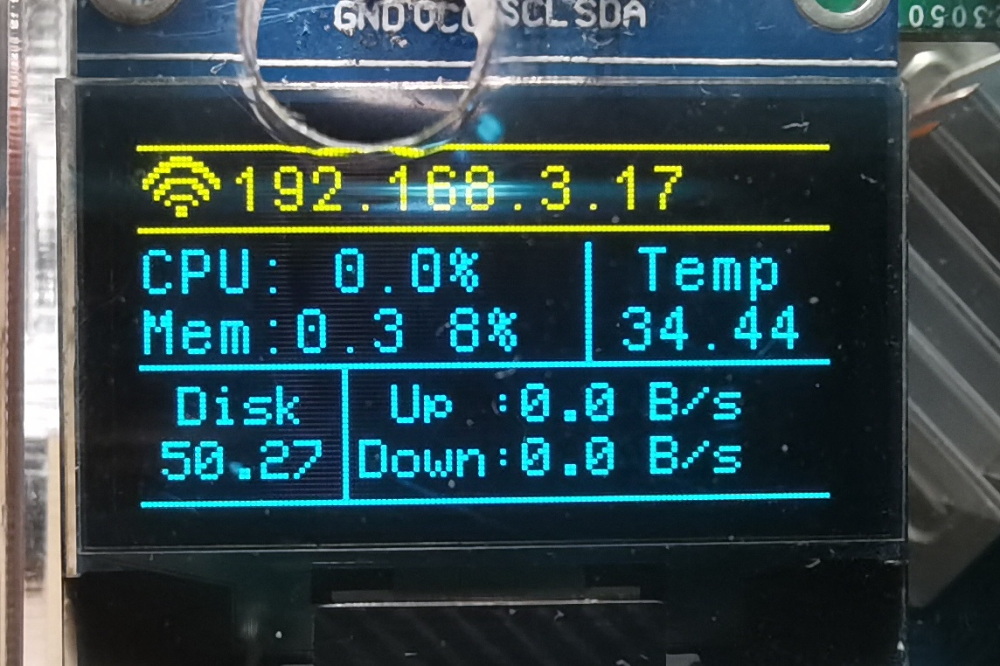

# 设备信息显示

 [SRC](https://github.com/Temperature6/OPi4_RTDevInfo)

能显示的信息包括：

1. **网络是否链接**（图标）
2. **IP地址**
3. **CPU使用率**（CPU）

4. **已用内存和使用率**（Mem）

5. **CPU温度**（Temp）

6. **磁盘剩余容量**（Disk）
7. **上下行网速**（Up/Down）

----

#### 使用

* make build：编译
* make run：运行