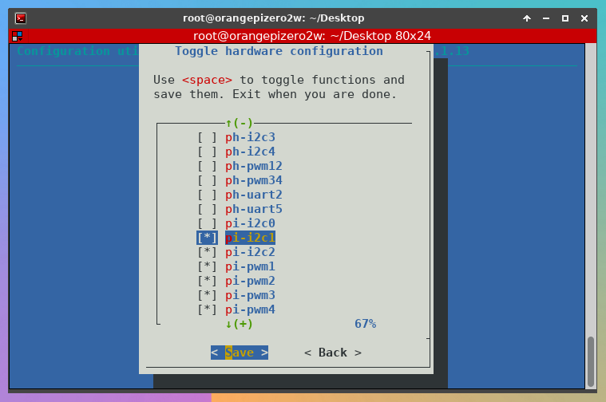
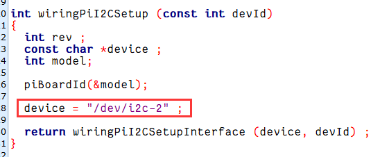

```shell
# enable i2c
$ sudo orangepi-config
# system -> hardware -> i2c
# save then reboot
```



```shell
# scan address
$ i2cdetect -l
i2c-0   i2c             mv64xxx_i2c adapter                     I2C adapter
i2c-1   i2c             DesignWare HDMI                         I2C adapter
i2c-2   i2c             mv64xxx_i2c adapter                     I2C adapter
i2c-3   i2c             mv64xxx_i2c adapter                     I2C adapter
i2c-4   i2c             mv64xxx_i2c adapter                     I2C adapter
$ i2cdetect -y 0
     0  1  2  3  4  5  6  7  8  9  a  b  c  d  e  f
00:                         -- -- -- -- -- -- -- --
10: -- -- -- -- -- -- -- -- -- -- -- -- -- -- -- --
20: -- -- -- -- -- -- -- -- -- -- -- -- -- -- -- --
30: -- -- -- -- -- -- UU -- -- -- -- -- -- -- -- --
40: -- -- -- -- -- -- -- -- -- -- -- -- -- -- -- --
50: -- -- -- -- -- -- -- -- -- -- -- -- -- -- -- --
60: -- -- -- -- -- -- -- -- -- -- -- -- -- -- -- --
70: -- -- -- -- -- -- -- --
$ i2cdetect -y 1
     0  1  2  3  4  5  6  7  8  9  a  b  c  d  e  f
00:                         -- -- -- -- -- -- -- --
10: -- -- -- -- -- -- -- -- -- -- -- -- -- -- -- --
20: -- -- -- -- -- -- -- -- -- -- -- -- -- -- -- --
30: 30 -- -- -- -- -- -- -- -- -- -- -- -- -- -- --
40: -- -- -- -- -- -- -- -- -- -- -- -- -- -- -- --
50: 50 -- -- -- -- -- -- -- -- -- -- -- -- -- -- --
60: -- -- -- -- -- -- -- -- -- -- -- -- -- -- -- --
70: -- -- -- -- -- -- -- --
root@orangepizero2w:/home/orangepi# i2cdetect -y 2
     0  1  2  3  4  5  6  7  8  9  a  b  c  d  e  f
00:                         -- -- -- -- -- -- -- --
10: -- -- -- -- -- -- -- -- -- -- -- -- -- -- -- --
20: -- -- -- -- -- -- -- -- -- -- -- -- -- -- -- --
30: -- -- -- -- -- -- -- -- -- -- -- -- 3c -- -- --
40: -- -- -- -- -- -- -- -- -- -- -- -- -- -- -- --
50: -- -- -- -- -- -- -- -- -- -- -- -- -- -- -- --
60: -- -- -- -- -- -- -- -- -- -- -- -- -- -- -- --
70: -- -- -- -- -- -- -- --

# set i2c device
$ cd /usr/src/wiringOP/wiringPi/
$ chmod 777 wiringPiI2C.c
$ vi wiringPiI2C.c

# modify i2c device
```



```shell
# recompile wiringPi
$ cd..
$ ./build

# compile then run example
$ cd /home/orangepi/Desktop/examples/i2c/ssd1306/
$ gcc -Wall -o app main.c -lwiringPi -lpthread
$ ./app

# compile then run default demo 
$ cd /usr/src/wiringOP/examples/
$ gcc -Wall -o app oled_demo.c -lwiringPi -lpthread
$ ./app /dev/i2c-2
```

