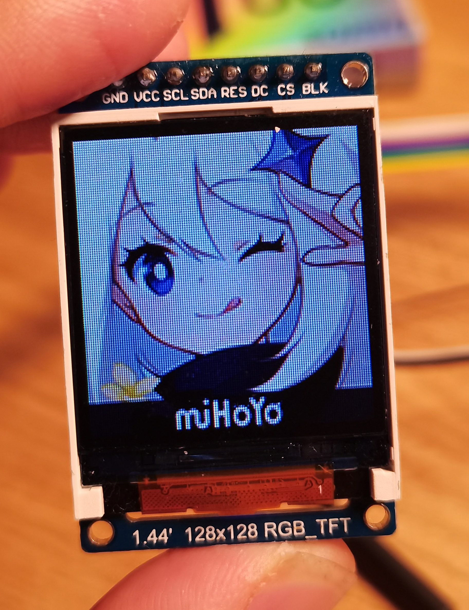
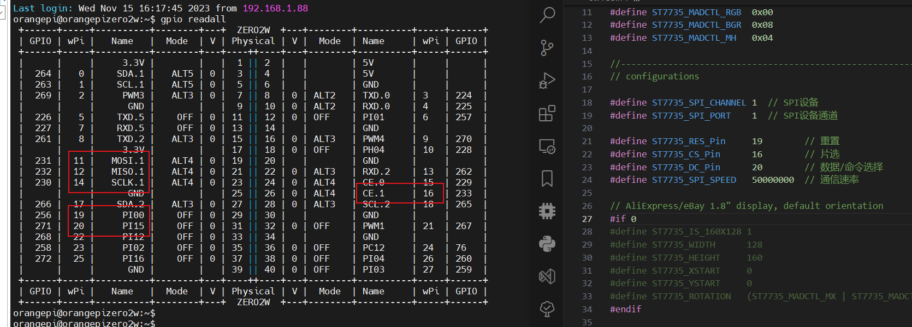
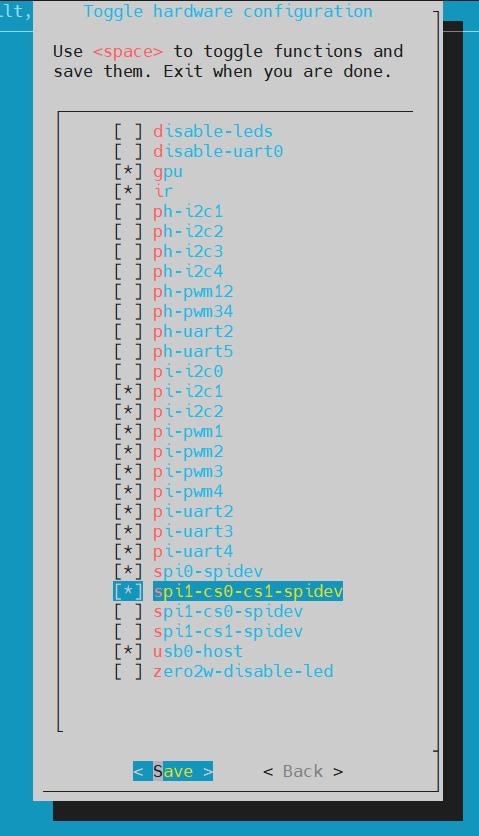

# ST7735

[src](https://github.com/Temperature6/ST7735_for_wiringPi/)，[lib](https://github.com/afiskon/stm32-st7735)

#### Preview



#### Pinmap



#### Usage

```bash
# enable spi-dev
$ su
$ orangepi-config
```



```bash
# check used gpio
$ gpio readall

# build then run
$ chmod 777 ./build.sh
$ ./build.sh
$ ./app
```

