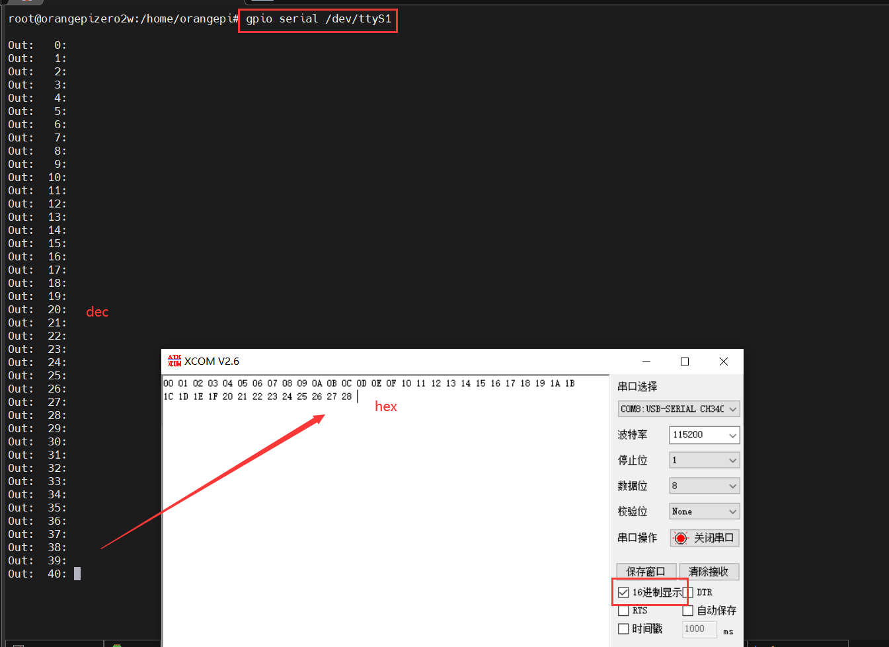

# UART

```bash
# display configurations
stty -F /dev/ttyS1 -a

# config uart
stty -F /dev/ttyS1 ispeed 115200 ospeed 115200 cs8

# send data
echo "abcdefg" > /dev/ttyS1

# receive data
cat /dev/ttyS1

# uart test
gpio serial /dev/ttyS1


```




## 

1. 设置某个串口参数信息：stty -F /dev/ttyS7 speed 115200 cs7 -parenb -cstopb -echo（7位数据位，无校验，1位停止位，无回显）

2. 设置串口参数：stty -F /dev/ttyS0 ispeed 115200 ospeed 115200 cs8；

3. stty命令的几项主要选项功能为：
   选项parenb使终端进行奇偶校验，-parenb则是禁止校验；
   选项cs5、cs6、cs7和cs8分别将字符大小设为5、6、7和8比特；
   选项300、600、1200、2400、4800、9600和19200设置波特率；
   cstopb和-cstopb分别设置两个或一个停止位；
   tabs使系统使用制表符而不是空格序列，因此减少了输出量，选项-tabs仅使用空格，当终端不能正确处理制表符（tab）时应使用该项。

   ospeed N
   　　speed
   　　打印出终端的速度
   　　csN
   　　把字符长度设为N, N 为[5..8]
   　　[-]cstopb
   　　对每字符使用两个停止位 (一个带有 `-')
   　　[-]parenb
   　　在输出中产生奇偶校验位，并要求在输入中也有奇偶校验位（'_'表示无校验）
   　　[-]parodd
   　　设置奇校验 (偶校验用 `-')