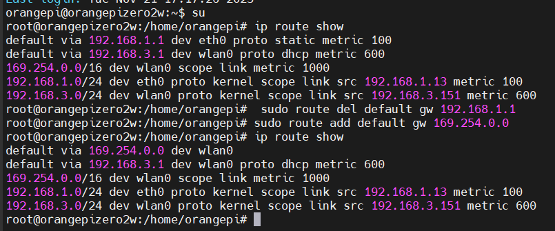

linux 有线和无线同时使用时，配置网络连接的优先级




#### 查看当前网关信息：

```bash
su

# 查看当前网关信息
ip route show
 
# 删除默认有线网关配置（此处的地址 不是有线网的 IP 地址，而是有线网的网关地址）
route del default gw 192.168.1.1 

# 添加 Wifi 网关为默认地址（此处的地址 wifi 的 IP 地址，而不是 wifi 网关地址）
sudo route add default gw 172.28.70.25

# 查看当前网关信息
ip route show
```


```
起因：
linux同时连接有线和无线网时，希望用有线连内网组网，如OAI EPC组网，用无线访问外网，但是默认会优先用有线。

解决：
所以设置限制，只允许目标地址为有线连接所在网段的数据包从有线走。

图形化界面操作：
system settings->network->wired->options->IPV4settings->Routes

勾选 use this connection only for resources on its network

此时，有线局域网就不影响在机器上访问外网了。

```

