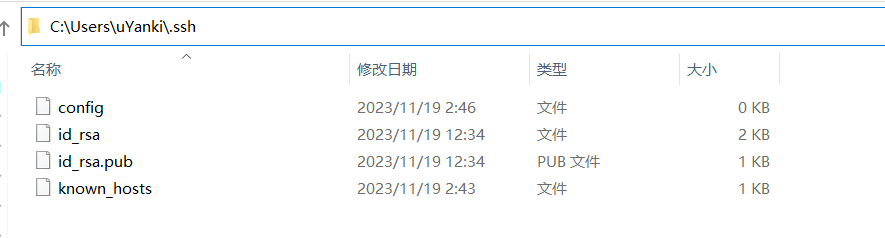
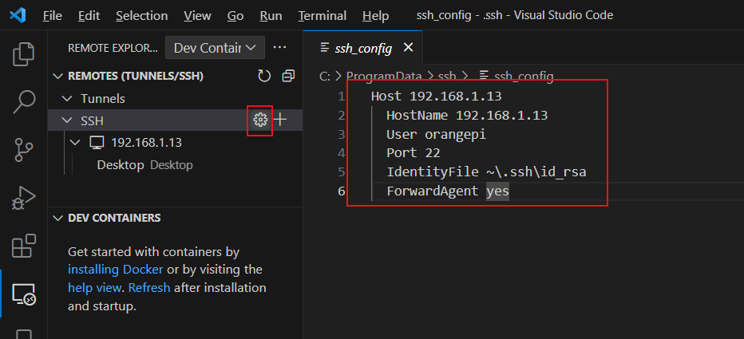
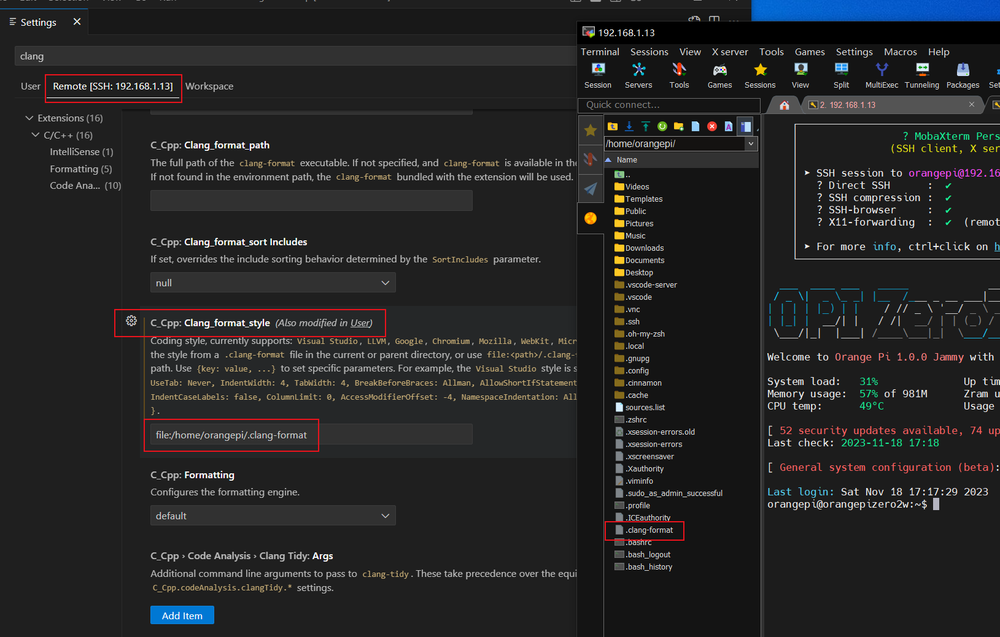

### VSCode

`powershell`

```powershell
$ ssh-keygen

# 设置保存路径（若要保存在默认路径，按 Enter 跳过即可）
Generating public/private rsa key pair.
Enter file in which to save the key (C:\Users\admin\.ssh/id_rsa):

# 若先前生成过 SSH 密钥, 会提示是否覆盖, 覆盖后无法再使用以前的密钥进行身份验证
/home/your_home/.ssh/id_rsa already exists.
Overwrite (y/n)?

# 设置安全密码，以防止未经授权的用户登录（为方便，按 Enter 跳过即可）
Enter passphrase (empty for no passphrase):

# 最终输出
Your identification has been saved in C:\Users\username/.ssh/id_rsa.
Your public key has been saved in C:\Users\username/.ssh/id_rsa.pub.
The key fingerprint is:
SHA256:AHau1BTmAPc2A0PVrahuZ1aUSUWsbiiybl57yGM6CB8 username@remote_host
The key's randomart image is:
+---[RSA 2048]----+
|  .oO.*o =o      |
|   o &  o o      |
|    . Xo =       |
|   . o.+*        |
|    .. +S        |
|. E o . +        |
|.o *.o o         |
|. =.B.=          |
| ++=.*           |
+----[SHA256]-----+

```


```
C:\Users\uYanki\.ssh
```




`MobaXterm`

```bash
# 创建目录
$ mkdir -p ~/.ssh
$ cd ~/.ssh/

# 将 id_rsa.pub 里的内容追加到 authorized_keys 文件的末尾
$ echo id_rsa.pub>> ~/.ssh/authorized_keys

# 查看authorized_keys 是否加入了id_rsa.pub
$ cat ~/.ssh/authorized_keys

将确保~/.ssh目录和authorized_keys文件具有适当的权限集：
$ chmod -R go= ~/.ssh

这递归地删除目录的所有“组”和“其他”权限~/.ssh/。

```




```
# 第一个
Host opi(eth)
  HostName 192.168.1.13
  User orangepi
  Port 22
  IdentityFile ~\.ssh\id_rsa
  ForwardAgent yes
  
# 第二个
Host opi(wifi)
  HostName 192.168.1.151
  User orangepi
  Port 22
  IdentityFile ~\.ssh\id_rsa
  ForwardAgent yes
```


https://blog.csdn.net/weixin_40248634/article/details/129158070


直接ssh命令登录
ssh 是怎么找到秘钥 id-rsa 的？
事实上，ssh xxx@11.11.11.01 的时候，其中有指定的命令–identity_file， 也就是身份认证，默认会在本地路径~/.ssh/优先找秘钥id-rsa，作为认证方式，找不到就让你输入密码。

直接登录

ssh xxx@11.11.11.01 
1
如果前面 Enter passphrase阶段有写密码，那么接下来输入的密码就是这个用于保护秘钥的密码。
如果前面Enter passphrase阶段密码为空，那么就直接登录上去了。

vscode 使用 ssh密钥 (key) 来连接到远程Linux上
添加配置文件

目的：配置 VSCode 连接远程服务器的一些基本信息。


```
file:/home/orangepi/.clang-format
```

